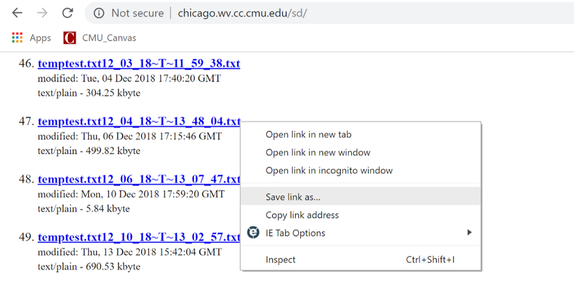
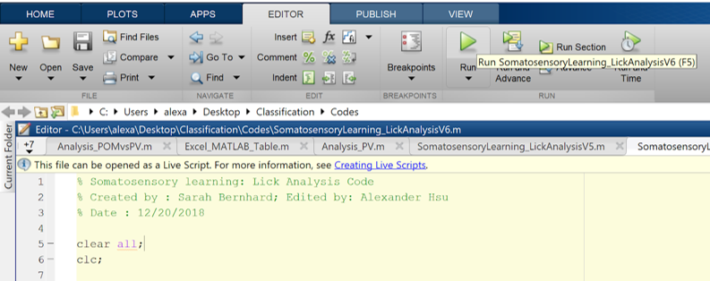
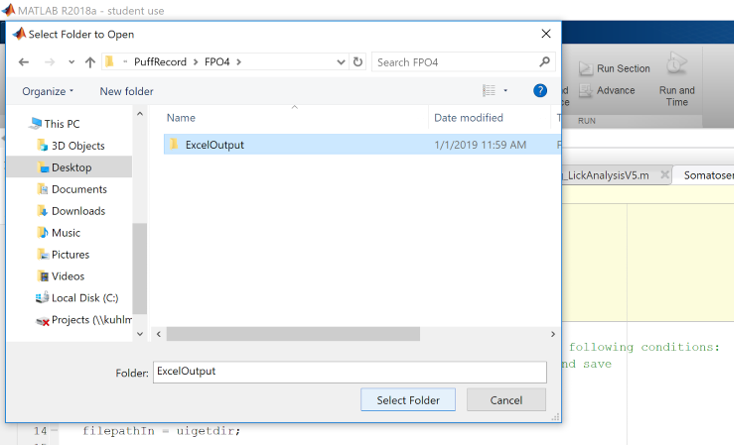
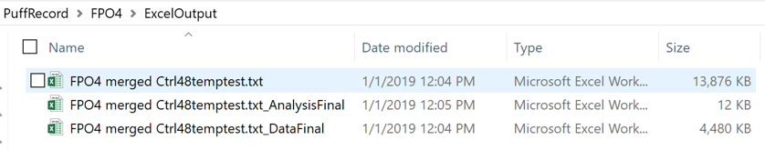

# Sensory-association-training-behavior

This usage of this algorithm has been outlined below.

## Installation

Git clone the web URL or download ZIP. 

Change your current working directory to the location where you want the cloned directory to be made.

```bash
git clone https://github.com/barthlab/Sensory-association-training-behavior.git
```

## Usage
Change the MATLAB current folder to the folder containing `Sensory-association-training-behavior-master/codes` 

### Step I
Download .txt data file from the server, i.e. chicago.wv.cc.cmu.edu/sd
1.1. Locate the files you hope to analyze, i.e. temptest.txt12_04_18~T~13_48_04.txt
1.2. Right click, save link as, and add whatever prefix you want. (DO NOT add underscore (“_”) in the name as the code uses them to find the start date and time) An example would be something like FPO4 merged Ctrl48 temptest.txt12_03_18_T_11_59_38


### Step II
*Run the code*
2.1.	Open `Sensory-association-training-behavior-master/codes/SAT_analysis.m` with a computer that has MATLAB programming installed. 
2.2.	Under Editor, click Run.


### Step III
3.1.	Once you click run, the program will open up a prompt for you to select the folder of which contains the data .txt file you stored. If there are multiple .txt files, it will automatically merge them.
3.2.	Once you have selected the folder of which contains the .txt data file, the script will show do a quick sanity check for the time-stamp, and open another prompt where you desire to store the excel files that contained all the analyses.


### Step IV
4.1.	Once the script finishes, your output folder will contain the following files. 

#### (1)FILE WITH ORIGINAL NAME - Excel file contents include day-wise and type-wise raw data split across sheets; 
#### (2)FILE WITH ORIGINAL NAME_AnalysisFinal- Excel file contents include colored rows showing day-wise and time bin-wise split licking and trial data in one sheet; 
#### (3) FILE WITH ORIGINAL NAME_DataFinal - Excel file contents include day-wise and time-bin wise split licking and trial data along with respective raw data spread across sheets; 
#### (4) FILE WITH ORIGINAL NAME_ForPlotting - Excel file containing arranged data for directly pasting into original graph template files for plotting; 
#### (5) FILE WIHT ORIGINAL NAME_Last20Data - Excel file containing sheets carrying information about raw and processed lick data for the last 20% of trials split day-wise; 
#### (6) FILE WITH ORIGINAL NAME_Plots - Matlab figure file showing the plots of lick frequence, trial and performance as three separate plots in one figure.

An example image of 3 of the listed files in the output folder



## Contributing

Pull requests are welcome. For recommended changes that you would like to see, open an issue.

We are a neuroscience lab and welcome all contributions to improve this algorithm. Please do not hesitate to contact us for any question/suggestion.

## License

This software package provided without warranty of any kind and is licensed under the GNU Lesser General Public License v3.0. 
If you use our algorithm and/or model/data, please cite us! Preprint/peer-review will be announced in the following section. (https://choosealicense.com/licenses/agpl-3.0/)

## News


## References


